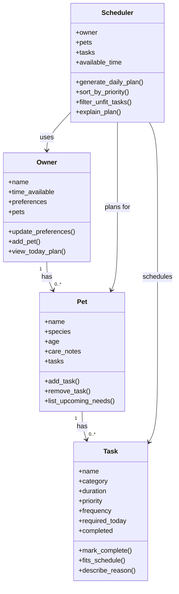

# PawPal+ Project Reflection

## 1. System Design

**a. Initial design**

- A user should be able to enter and update basic owner and pet information so the app knows who the schedule is for and what kind of care the pet needs.
- A user should be able to add and manage pet care tasks such as walks, feeding, medication, grooming, or playtime, including details like duration and priority.
- A user should be able to generate and review today's care plan so they can see which tasks should happen, in what order, and why those tasks were chosen.
- My initial UML design includes four main objects: `Owner`, `Pet`, `Task`, and `Scheduler`.
- `Owner` holds information such as the owner's name, time available, daily preferences, and a list of pets. Its methods could include updating preferences, adding a pet, and viewing today's plan.
- `Pet` holds information such as the pet's name, species, age, care notes, and its list of care tasks. Its methods could include adding a task, removing a task, and listing upcoming needs.
- `Task` holds information such as the task name, category, duration, priority, frequency, and whether it is required today. Its methods could include marking the task complete, checking whether it fits the schedule, and describing why it matters.
- `Scheduler` holds the owner, the pet or pets, the available tasks, and the time constraints for the day. Its methods could include generating a daily plan, sorting tasks by priority, filtering tasks that do not fit, and explaining the final schedule.
- Mermaid UML draft:

- Briefly describe your initial UML design.
- What classes did you include, and what responsibilities did you assign to each?

**b. Design changes**

- Did your design change during implementation?
- If yes, describe at least one change and why you made it.

---

## 2. Scheduling Logic and Tradeoffs

**a. Constraints and priorities**

- What constraints does your scheduler consider (for example: time, priority, preferences)?
- How did you decide which constraints mattered most?

**b. Tradeoffs**

- Describe one tradeoff your scheduler makes.
- Why is that tradeoff reasonable for this scenario?

---

## 3. AI Collaboration

**a. How you used AI**

- How did you use AI tools during this project (for example: design brainstorming, debugging, refactoring)?
- What kinds of prompts or questions were most helpful?

**b. Judgment and verification**

- Describe one moment where you did not accept an AI suggestion as-is.
- How did you evaluate or verify what the AI suggested?

---

## 4. Testing and Verification

**a. What you tested**

- What behaviors did you test?
- Why were these tests important?

**b. Confidence**

- How confident are you that your scheduler works correctly?
- What edge cases would you test next if you had more time?

---

## 5. Reflection

**a. What went well**

- What part of this project are you most satisfied with?

**b. What you would improve**

- If you had another iteration, what would you improve or redesign?

**c. Key takeaway**

- What is one important thing you learned about designing systems or working with AI on this project?
