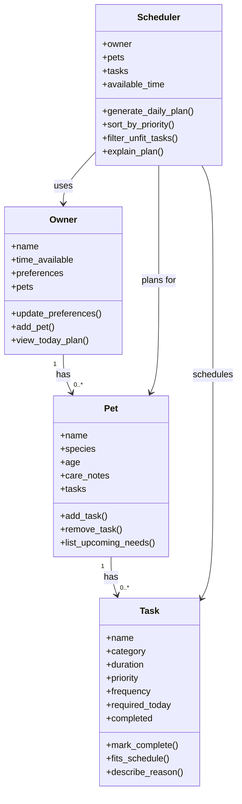

# PawPal+ Project Reflection

## 1. System Design

**a. Initial design**

- My initial design focused on four classes: `Owner`, `Pet`, `Task`, and `Scheduler`. I chose these because they match the real parts of the problem. The owner provides the time limits and preferences, the pet represents who needs care, the task represents each care activity, and the scheduler is responsible for building the final daily plan.
- `Owner` is responsible for storing the owner's name, available time, preferences, and pets. This class acts as the top-level user context for the app.
- `Pet` is responsible for storing pet-specific information such as name, species, age, care notes, and the list of tasks for that pet. This keeps care information grouped around the pet instead of mixing it directly into the scheduler.
- `Task` is responsible for storing the details of a single care item, including its category, duration, priority, frequency, and completion status. This makes each task easy to sort, filter, and explain later.
- `Scheduler` is responsible for turning the owner's constraints and the pets' tasks into a daily plan. I gave it methods for sorting tasks by priority, filtering tasks that do not fit, generating the final plan, and explaining why the plan was chosen.
- Mermaid UML draft:

- Briefly describe your initial UML design.
- What classes did you include, and what responsibilities did you assign to each?

**b. Design changes**

- Yes. After reviewing the class skeleton, I noticed that `Scheduler` was storing both an `owner` and separate `pets` and `tasks` lists. That created a risk that the scheduler's copies could get out of sync with the pets already attached to the owner.
- I changed the design so `Scheduler` keeps the `owner` as its main relationship and derives `pets` and `tasks` from that owner when needed. This reduces duplicate state and should make the scheduling logic simpler and less error-prone during implementation.

---

## 2. Scheduling Logic and Tradeoffs

**a. Constraints and priorities**

- What constraints does your scheduler consider (for example: time, priority, preferences)?
- How did you decide which constraints mattered most?

**b. Tradeoffs**

- Describe one tradeoff your scheduler makes.
- Why is that tradeoff reasonable for this scenario?

---

## 3. AI Collaboration

**a. How you used AI**

- How did you use AI tools during this project (for example: design brainstorming, debugging, refactoring)?
- What kinds of prompts or questions were most helpful?

**b. Judgment and verification**

- Describe one moment where you did not accept an AI suggestion as-is.
- How did you evaluate or verify what the AI suggested?

---

## 4. Testing and Verification

**a. What you tested**

- What behaviors did you test?
- Why were these tests important?

**b. Confidence**

- How confident are you that your scheduler works correctly?
- What edge cases would you test next if you had more time?

---

## 5. Reflection

**a. What went well**

- What part of this project are you most satisfied with?

**b. What you would improve**

- If you had another iteration, what would you improve or redesign?

**c. Key takeaway**

- What is one important thing you learned about designing systems or working with AI on this project?
