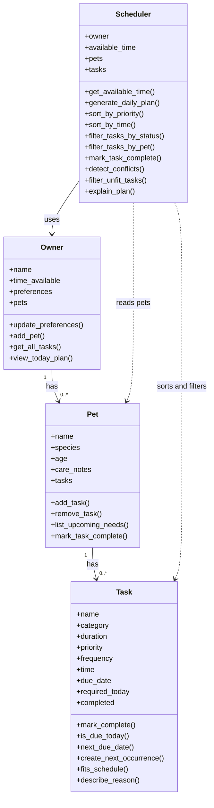

# PawPal+ Project Reflection

## 1. System Design

**a. Initial design**

- My initial design focused on four classes: `Owner`, `Pet`, `Task`, and `Scheduler`. I chose these because they match the real parts of the problem. The owner provides the time limits and preferences, the pet represents who needs care, the task represents each care activity, and the scheduler is responsible for building the final daily plan.
- `Owner` is responsible for storing the owner's name, available time, preferences, and pets. This class acts as the top-level user context for the app.
- `Pet` is responsible for storing pet-specific information such as name, species, age, care notes, and the list of tasks for that pet. This keeps care information grouped around the pet instead of mixing it directly into the scheduler.
- `Task` is responsible for storing the details of a single care item, including its category, duration, priority, frequency, and completion status. This makes each task easy to sort, filter, and explain later.
- `Scheduler` is responsible for turning the owner's constraints and the pets' tasks into a daily plan. I gave it methods for sorting tasks by priority, filtering tasks that do not fit, generating the final plan, and explaining why the plan was chosen.
- Mermaid UML draft:

- Briefly describe your initial UML design.
- What classes did you include, and what responsibilities did you assign to each?

**b. Design changes**

- Yes. After reviewing the class skeleton, I noticed that `Scheduler` was storing both an `owner` and separate `pets` and `tasks` lists. That created a risk that the scheduler's copies could get out of sync with the pets already attached to the owner.
- I changed the design so `Scheduler` keeps the `owner` as its main relationship and derives `pets` and `tasks` from that owner when needed. This reduces duplicate state and should make the scheduling logic simpler and less error-prone during implementation.

---

## 2. Scheduling Logic and Tradeoffs

**a. Constraints and priorities**

- What constraints does your scheduler consider (for example: time, priority, preferences)?
- How did you decide which constraints mattered most?

**b. Tradeoffs**

- One tradeoff my scheduler makes is in conflict detection. Right now it only checks whether two tasks have the exact same scheduled start time, instead of calculating more realistic overlaps based on task duration or flexible time windows.
- I considered a more compact and "Pythonic" approach that groups tasks by time in a dictionary, but I kept the simpler loop-based version because it is easier to read and explain. For this project, that tradeoff is reasonable because the goal is to provide a lightweight warning without adding too much complexity to an early version of the app.

---

## 3. AI Collaboration

**a. How you used AI**

- I used VS Code Copilot most heavily for design brainstorming, turning UML ideas into class skeletons, drafting tests, and reviewing whether my scheduling logic matched the structure of the project. The most effective Copilot features were chat-based code review, quick drafting of class and test stubs, and targeted questions about specific Python tools like `sorted()`, `lambda`, and `timedelta`.
- The most helpful prompts were narrow and concrete. For example, asking how the `Scheduler` should retrieve tasks from the `Owner` helped me keep the relationships clean, and asking what edge cases mattered most for sorting and recurrence helped me plan my tests. Prompts that referenced a specific file or a single method were much more useful than broad requests for "the whole solution."

**b. Judgment and verification**

- One important moment where I did not accept an AI suggestion as-is was around the scheduler design. A more automatic approach would have let `Scheduler` keep its own copies of pets and tasks, but I rejected that because it would duplicate state that already lived on the `Owner` and `Pet` objects. I changed the design so the scheduler derives pets and tasks from the owner instead.
- I also reviewed a more compact conflict-detection approach, but I kept the simpler loop version because it was easier to read and explain. I evaluated these suggestions by comparing them to my UML, checking whether they made the relationships cleaner, and then verifying behavior through `main.py`, `pytest`, and the Streamlit UI. Using separate chat sessions for different phases also helped a lot because it kept design questions, algorithm questions, and testing questions from getting mixed together. That made it easier to stay organized and treat each phase like a focused engineering task instead of one long, messy conversation.

---

## 4. Testing and Verification

**a. What you tested**

- What behaviors did you test?
- Why were these tests important?

**b. Confidence**

- How confident are you that your scheduler works correctly?
- What edge cases would you test next if you had more time?

---

## 5. Reflection

**a. What went well**

- What part of this project are you most satisfied with?
- I am most satisfied with how the project grew from a simple UML design into a working system with a clear separation between the backend logic and the Streamlit UI. The scheduler, recurrence logic, conflict warnings, persistence, and tests all connect in a way that feels organized instead of rushed.

**b. What you would improve**

- If you had another iteration, what would you improve or redesign?
- If I had another iteration, I would improve the scheduling algorithm so it could reason about overlapping task durations instead of only exact matching start times. I would also add stronger input validation in the UI, more edge-case tests, and more editing controls so users could update or remove pets and tasks more easily.

**c. Key takeaway**

- What is one important thing you learned about designing systems or working with AI on this project?
- One important thing I learned is that AI works best when I act as the lead architect instead of treating it like an autopilot. Copilot was very useful for generating options, speeding up coding, and surfacing ideas I might have missed, but I still had to decide which structure was clean, which tradeoffs were acceptable, and how to verify that the system really worked. The best results came from using AI as a fast collaborator while I stayed responsible for the final design.
